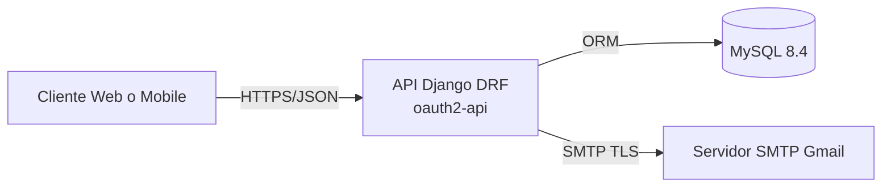
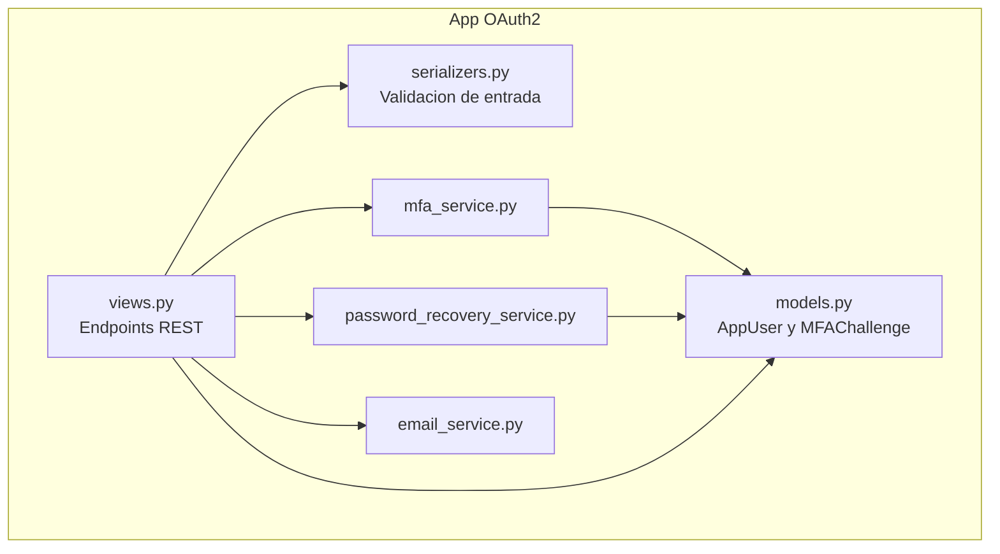

# Arquitectura de Alto Nivel

## 1. Contexto del Sistema

El proyecto implementa una API de autenticacion basada en:

- Registro de usuarios.
- Login con segundo factor opcional por email.
- Recuperacion de contrasena en 3 pasos: solicitar codigo, verificar codigo, cambiar contrasena.

## 2. Vista de Contenedores

## 3. Vista de Componentes (Backend)

## 4. Responsabilidades por Capa

- Routing: `oauth2_project/urls.py` y `OAuth2/urls.py`.
- API layer: clases `APIView` en `OAuth2/views.py`.
- Validacion de payload: serializers en `OAuth2/serializers.py`.
- Dominio/persistencia: `AppUser` y `MFAChallenge` en `OAuth2/models.py`.
- Logica de negocio:
  - MFA: `OAuth2/services/mfa_service.py`.
  - Password recovery: `OAuth2/services/password_recovery_service.py`.
  - Notificaciones: `OAuth2/services/email_service.py`.
- Configuracion global: `oauth2_project/settings.py`.

## 5. Integraciones Externas

- MySQL: almacenamiento de usuarios y desafios MFA.
- SMTP Gmail: envio de codigos MFA y recuperacion.

## 6. Flujos Funcionales Principales

- Registro: crea usuario con password hasheada por Django.
- Login con MFA habilitado: genera codigo de 6 digitos, lo envia por email y requiere validacion posterior.
- Recuperacion de contrasena:
  - `request-code`: crea desafio `RESET_PASSWORD`.
  - `verify-code`: valida codigo y marca `verified_at`.
  - `change-password`: exige desafio verificado y vigente.

## 7. Decisiones Arquitectonicas Relevantes

- Reutilizacion de entidad `MFAChallenge` para login MFA y recuperacion.
- Codigos almacenados hasheados (`make_password`) para no guardar secretos en texto plano.
- Uso de `verified_at` para separar explicitamente validacion de codigo del cambio de contrasena.
- Invalidacion de desafios anteriores al crear uno nuevo para el mismo usuario/proposito.
