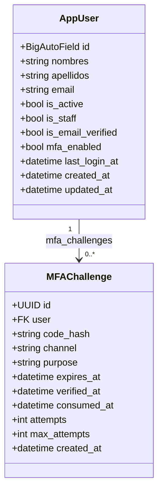
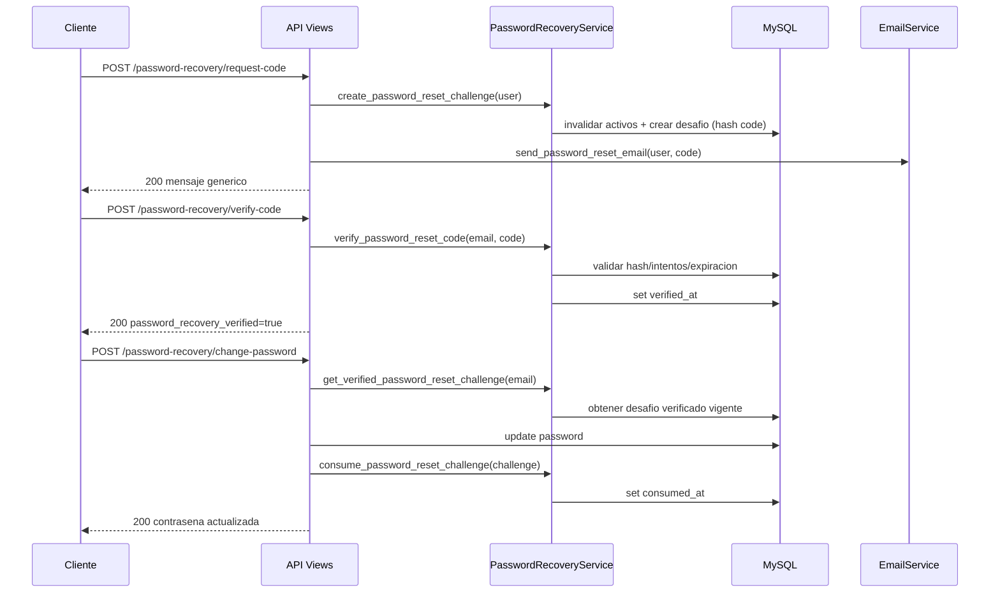
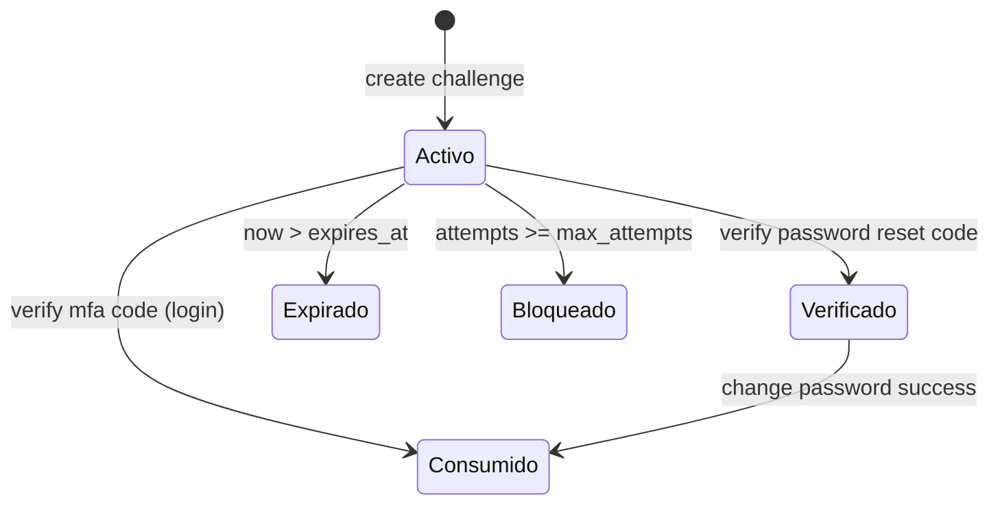

# Diseno de Bajo Nivel

## 1. Diagrama UML de Clases

## 2. Servicios de Dominio

### 2.1 `mfa_service.py`

- `generate_6_digit_code()`: genera codigo pseudoaleatorio de 6 digitos.
- `create_mfa_challenge(user, purpose)`:
  - invalida desafios activos previos del mismo proposito;
  - crea desafio nuevo con expiracion de 5 min.
- `verify_mfa_code(challenge, code)`:
  - valida estado (`consumed_at`, expiracion, intentos maximos);
  - compara hash del codigo;
  - incrementa intentos en fallo;
  - marca `consumed_at` en exito.

### 2.2 `password_recovery_service.py`

- `create_password_reset_challenge(user)`:
  - invalida desafios activos anteriores `RESET_PASSWORD`;
  - crea desafio con codigo de 6 digitos, hash y expiracion de 10 min.
- `verify_password_reset_code(email, code)`:
  - obtiene desafio activo mas reciente;
  - valida expiracion e intentos;
  - compara hash;
  - marca `verified_at` al validar.
- `get_verified_password_reset_challenge(email)`:
  - exige desafio verificado, no consumido y vigente.
- `consume_password_reset_challenge(challenge)`:
  - marca `consumed_at` tras cambiar contrasena.

### 2.3 `email_service.py`

- `send_mfa_email(user, code)`: envia codigo MFA en texto + HTML.
- `send_password_reset_email(user, code)`: envia codigo de recuperacion en texto + HTML.
- Remitente: toma `DEFAULT_FROM_EMAIL` y fallback a `EMAIL_HOST_USER`.

## 3. Controladores REST (Views)

### 3.1 `RegisterView`

- Valida y crea usuario (`RegisterSerializer`).
- Retorna datos basicos del usuario.

### 3.2 `LoginView`

- Valida credenciales (`LoginSerializer`).
- Si `mfa_enabled=True`, crea desafio MFA y envia codigo por email.
- Si no, completa login sin MFA.

### 3.3 `VerifyMFAView`

- Busca desafio `LOGIN` activo mas reciente.
- Verifica codigo y consume el desafio.

### 3.4 `RequestPasswordRecoveryView`

- Si usuario existe y esta activo, crea desafio y envia email.
- Si no existe, responde mensaje generico para evitar enumeracion.

### 3.5 `VerifyPasswordRecoveryCodeView`

- Valida codigo de recuperacion.
- Marca desafio como verificado (`verified_at`).

### 3.6 `ChangePasswordWithRecoveryView`

- Requiere desafio de recuperacion previamente verificado.
- Ejecuta en transaccion atomica.
- Valida politica de contrasena Django.
- Actualiza password y consume desafio.

## 4. Secuencia de Recuperacion de Contrasena

## 5. Estados del `MFAChallenge`

