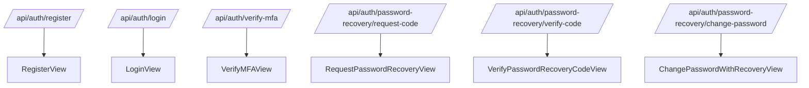

# API REST

Base path: `/api/auth/`

## 1. Endpoints

### 1.1 Registro

- Metodo: `POST`
- Ruta: `/register/`
- Body:

```json
{
  "nombres": "Jhonathan",
  "apellidos": "Gutierrez",
  "email": "usuario@dominio.com",
  "password": "PasswordSeguro123"
}
```

- Respuesta exitosa: `201 Created`

### 1.2 Login

- Metodo: `POST`
- Ruta: `/login/`
- Body:

```json
{
  "email": "usuario@dominio.com",
  "password": "PasswordSeguro123"
}
```

- Respuesta MFA habilitado: `200 OK`

```json
{
  "message": "Código MFA enviado al correo",
  "mfa_required": true,
  "email": "usuario@dominio.com"
}
```

- Respuesta sin MFA: `200 OK`

```json
{
  "message": "Login exitoso",
  "mfa_required": false,
  "user": {
    "id": 1,
    "email": "usuario@dominio.com",
    "nombres": "Nombre",
    "apellidos": "Apellido"
  }
}
```

### 1.3 Verificar MFA

- Metodo: `POST`
- Ruta: `/verify-mfa/`
- Body:

```json
{
  "email": "usuario@dominio.com",
  "code": "123456"
}
```

- Respuesta: `200 OK` o `400 Bad Request`.

### 1.4 Solicitar codigo de recuperacion

- Metodo: `POST`
- Ruta: `/password-recovery/request-code/`
- Body:

```json
{
  "email": "usuario@dominio.com"
}
```

- Respuesta: siempre `200 OK` con mensaje generico.

### 1.5 Verificar codigo de recuperacion

- Metodo: `POST`
- Ruta: `/password-recovery/verify-code/`
- Body:

```json
{
  "email": "usuario@dominio.com",
  "code": "123456"
}
```

- Respuesta exitosa: `200 OK`

```json
{
  "message": "Código validado correctamente",
  "password_recovery_verified": true
}
```

### 1.6 Cambiar contrasena con recuperacion

- Metodo: `POST`
- Ruta: `/password-recovery/change-password/`
- Body:

```json
{
  "email": "usuario@dominio.com",
  "new_password": "NuevoPasswordSegura123"
}
```

- Precondicion: codigo validado previamente y desafio vigente.
- Respuesta exitosa: `200 OK`.

## 2. Errores Funcionales Frecuentes

- Credenciales invalidas: `400`.
- Codigo MFA o recovery invalido/expirado: `400`.
- Intento de cambio sin validacion previa de recovery: `400`.

## 3. Mapa de Rutas



## 4. Contratos de Validacion

- `RegisterSerializer`: valida email y password minima de 8 caracteres.
- `LoginSerializer`: valida existencia, password y estado activo.
- `VerifyMFASerializer`: `code` de 6 caracteres.
- `VerifyPasswordRecoveryCodeSerializer`: `email + code`.
- `ChangePasswordWithRecoverySerializer`: `email + new_password`.
