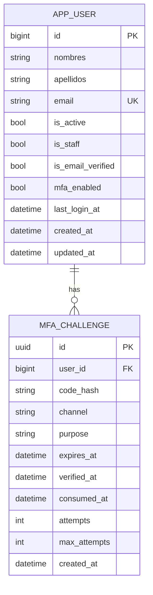

# Modelo de Datos

## 1. Entidades

### 1.1 `app_user`

Representa al usuario autenticable del sistema.

Campos principales:

- `id` (PK, BigAutoField)
- `nombres`
- `apellidos`
- `email` (unico)
- `password` (hash Django)
- `is_active`
- `is_staff`
- `is_email_verified`
- `mfa_enabled`
- `last_login_at`
- `created_at`
- `updated_at`

### 1.2 `mfa_challenge`

Representa desafios de verificacion para distintos propositos.

Campos principales:

- `id` (PK, UUID)
- `user_id` (FK a `app_user`)
- `code_hash`
- `channel` (`EMAIL`)
- `purpose` (`LOGIN`, `RESET_PASSWORD`, etc.)
- `expires_at`
- `verified_at` (usado por recuperacion de contrasena)
- `consumed_at`
- `attempts`
- `max_attempts`
- `created_at`

## 2. Diagrama ER

## 3. Reglas de Integridad de Negocio

- Solo se permite un desafio activo por usuario + proposito: al crear uno nuevo, los anteriores se consumen.
- `attempts` no puede exceder `max_attempts` para validar codigo.
- Un desafio expirado no puede verificarse ni consumirse funcionalmente.
- Para `RESET_PASSWORD`, el cambio de contrasena exige `verified_at` no nulo y `consumed_at` nulo.

## 4. Migraciones

- `0001_initial`: crea `AppUser` y `MFAChallenge`.
- `0002_mfachallenge_verified_at`: agrega campo `verified_at` en `MFAChallenge`.

## 5. Consideraciones de Rendimiento

Sugerencias de indices para crecimiento:

- `MFAChallenge(user_id, purpose, consumed_at, created_at)`.
- `MFAChallenge(user_id, purpose, verified_at, consumed_at)` para recuperacion.
- `AppUser(email)` ya esta optimizado por restriccion unica.
