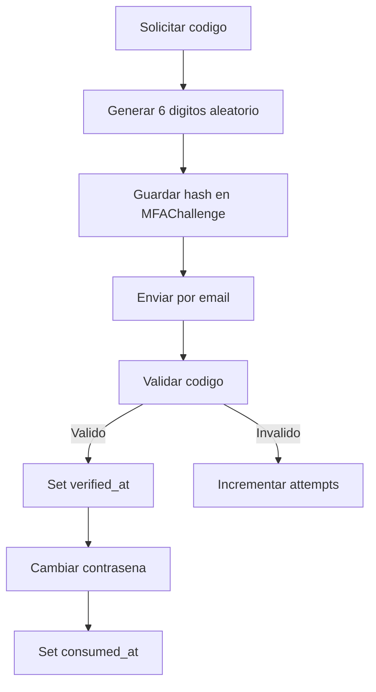

# Seguridad OWASP y Buenas Practicas

## 1. Controles ya implementados

### A07:2021 - Identification and Authentication Failures

- Passwords hasheadas por `set_password` de Django.
- MFA por codigo de 6 digitos para login (si `mfa_enabled=True`).
- Recuperacion de contrasena con codigo temporal y de un solo uso.

### A02:2021 - Cryptographic Failures

- No se persiste el codigo plano, solo `code_hash`.
- SMTP configurado con TLS (`EMAIL_USE_TLS=True`).

### A01:2021 - Broken Access Control (parcial)

- Flujos sensibles encapsulados en API especifica por caso de uso.
- Uso de `transaction.atomic` en cambio de contrasena por recuperacion.

### A09:2021 - Security Logging and Monitoring Failures (parcial)

- Logger dedicado `OAuth2` con eventos de recuperacion y envio de correo.

## 2. Riesgos actuales y mejoras recomendadas

### 2.1 Secretos en repositorio

- Riesgo: credenciales reales o `SECRET_KEY` en archivos versionados.
- Mejora: mover secretos a variables de entorno seguras y no comitearlas.

### 2.2 DEBUG habilitado

- Riesgo: exposicion de detalles internos en errores.
- Mejora: `DEBUG=False` en produccion y `ALLOWED_HOSTS` definidos.

### 2.3 Rate limiting ausente

- Riesgo: fuerza bruta de codigos y abuso de endpoint de request-code.
- Mejora: throttling por IP y por email con DRF throttles o Redis.

### 2.4 Falta de bloqueo temporal progresivo

- Riesgo: ataque de intentos distribuidos.
- Mejora: backoff exponencial por usuario/canal/proposito.

### 2.5 Sin auditoria persistente de seguridad

- Riesgo: baja trazabilidad forense.
- Mejora: guardar eventos de seguridad en tabla o SIEM.

## 3. Checklist de Hardening

- [ ] `DEBUG=False` en produccion.
- [ ] `SECRET_KEY` fuera del repositorio.
- [ ] `ALLOWED_HOSTS` y CORS restringidos.
- [ ] `SECURE_SSL_REDIRECT=True` en produccion.
- [ ] Cookies seguras (`SESSION_COOKIE_SECURE`, `CSRF_COOKIE_SECURE`).
- [ ] Rate limiting por endpoint sensible.
- [ ] Politicas de password mas robustas.
- [ ] Monitoreo y alertas de seguridad.

## 4. Flujo seguro recomendado para password recovery

## 5. Politica de Errores

Buenas practicas adoptadas:

- Mensaje generico en solicitud de recuperacion para evitar enumeracion.
- Respuesta explicita de error para codigo invalido/expirado.

Mejora sugerida:

- Homogeneizar tiempos de respuesta para casos existente/no existente.
